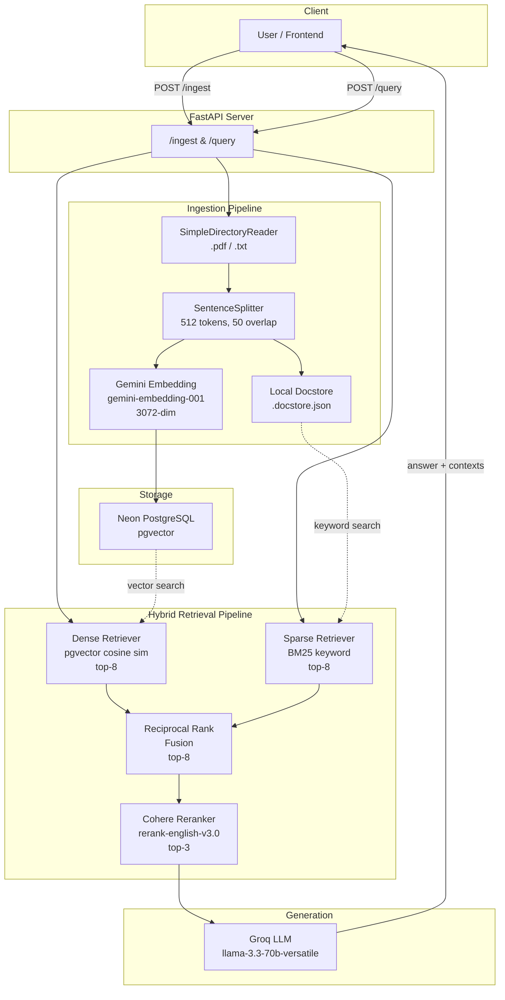
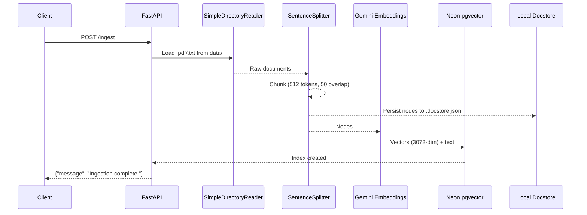
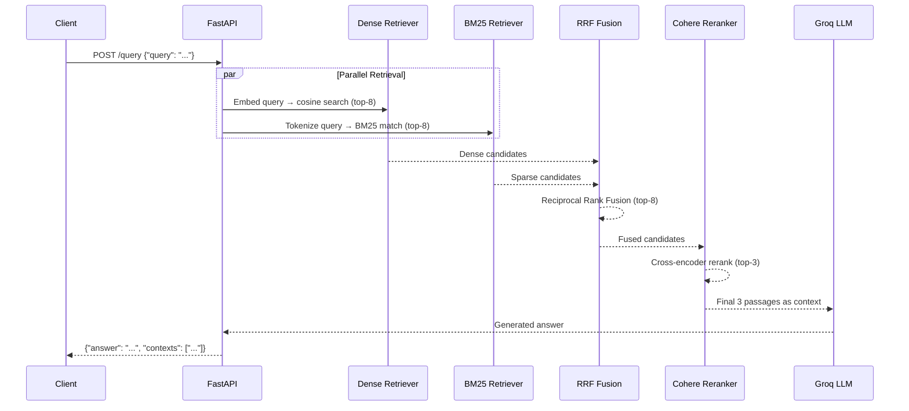
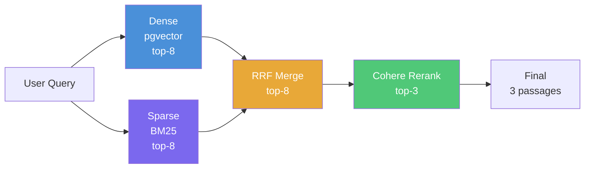
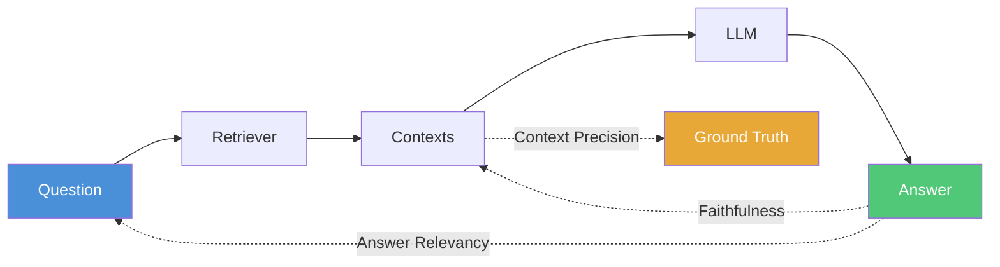

# RAG Pipeline — Backend

A production-oriented Retrieval-Augmented Generation backend built with **FastAPI**, **LlamaIndex**, and a **hybrid retrieval** strategy (dense + sparse + rerank). Ingests PDF/TXT documents, stores embeddings in **Neon PostgreSQL (pgvector)**, and serves answers through a Groq-hosted LLM.

---

## Table of Contents

- [Architecture Overview](#architecture-overview)
- [Project Structure](#project-structure)
- [Request Lifecycle](#request-lifecycle)
- [Retrieval Pipeline Deep-Dive](#retrieval-pipeline-deep-dive)
- [Architectural Decisions & Rationale](#architectural-decisions--rationale)
- [Tradeoffs](#tradeoffs)
- [Tech Stack](#tech-stack)
- [Getting Started](#getting-started)
- [API Reference](#api-reference)
- [Evaluation](#evaluation)
- [Configuration](#configuration)

---

## Architecture Overview



---

## Project Structure

```
backend/
├── app/
│   ├── main.py              # FastAPI app factory & health check
│   ├── api/
│   │   └── routes.py         # POST /ingest, POST /query
│   ├── core/
│   │   └── config.py         # Pydantic Settings (.env loader)
│   └── rag/
│       ├── ingest.py          # Document loading, chunking, embedding, storage
│       ├── retriever.py       # Hybrid retriever (dense + BM25 + RRF + rerank)
│       └── pipeline.py        # Query orchestration (retrieve → prompt → LLM)
├── data/                      # Drop .pdf / .txt files here before ingesting
├── eval/
│   ├── evaluate.py            # RAGAS automated evaluation script
│   ├── test_set.json          # Ground-truth Q&A pairs
│   └── README.md              # Evaluation metrics documentation
├── .env.example               # Required environment variables
├── pyproject.toml             # Dependencies (managed by uv)
└── main.py                    # Placeholder entry point
```

---

## Request Lifecycle

### Ingestion (`POST /ingest`)



### Query (`POST /query`)



---

## Retrieval Pipeline Deep-Dive

The retriever is the most architecturally significant component. It chains four stages to maximise both **recall** (find all relevant chunks) and **precision** (surface only the best ones).



| Stage | What It Does | Why It Matters |
|-------|-------------|----------------|
| **Dense (pgvector)** | Embeds the query with Gemini, runs cosine similarity over stored vectors | Captures _semantic_ meaning — paraphrases, synonyms, conceptual matches |
| **Sparse (BM25)** | Classic keyword/term-frequency matching over the docstore | Catches _exact_ matches — proper nouns, tickers, acronyms that embeddings can miss |
| **RRF Fusion** | Merges both ranked lists using Reciprocal Rank Fusion (`1/(k+rank)`) | Combines the best of both worlds without needing to calibrate heterogeneous scores |
| **Cohere Rerank** | Cross-encoder that reads (query, passage) pairs holistically | Acts as a precision filter — computationally expensive but far more accurate than bi-encoder similarity |

### Tunables

```python
DENSE_TOP_K  = 8   # candidates from pgvector
SPARSE_TOP_K = 8   # candidates from BM25
FUSION_TOP_K = 8   # candidates after RRF merge
RERANK_TOP_N = 3   # final passages sent to the LLM
```

The funnel shape (8 → 8 → 8 → 3) is deliberate: cast a wide net, then aggressively filter.

---

## Architectural Decisions & Rationale

### 1. Hybrid Retrieval over Pure Vector Search

> **Decision:** Combine dense (vector) and sparse (BM25) retrieval instead of relying on embeddings alone.

**Why:** Pure vector search fails on exact-match queries — specific tickers like "XAUUSD", numeric values, or domain jargon. BM25 excels at these but misses semantic similarity. Hybrid retrieval covers both failure modes.

**Alternative considered:** Vector-only with aggressive chunk overlap. Rejected because it still drops exact keyword matches and increases storage cost.

---

### 2. Reciprocal Rank Fusion (RRF) over Learned Fusion

> **Decision:** Use RRF (`1/(k+rank)`) to merge dense and sparse result lists.

**Why:** RRF is score-agnostic — it works purely on rank positions, so you don't need to normalise the incompatible score distributions from cosine similarity and BM25 TF-IDF. It's also deterministic, parameter-free (aside from `k=60` default), and proven effective in information retrieval benchmarks.

**Alternative considered:** Linear combination of normalised scores. Rejected because score distributions shift across query types, making a fixed weight fragile.

---

### 3. Cohere Cross-Encoder Reranking as Final Stage

> **Decision:** Add a Cohere reranker (`rerank-english-v3.0`) after fusion, reducing candidates from 8 to 3.

**Why:** Bi-encoder retrieval (both dense and sparse) scores query and document independently. A cross-encoder reads the (query, document) pair jointly, capturing fine-grained relevance that bi-encoders miss. This is too expensive for the initial retrieval stage but ideal as a precision filter over a small candidate set.

**Alternative considered:** No reranking (send all 8 fused results to the LLM). Rejected because LLMs are sensitive to noise in the context window — irrelevant passages degrade answer quality and increase hallucination risk.

---

### 4. Gemini Embeddings (3072-dim) over OpenAI

> **Decision:** Use `gemini-embedding-001` (3072 dimensions) for document and query embeddings.

**Why:** Higher dimensionality captures more nuance in the embedding space, especially for domain-specific financial content. Gemini embeddings also offer a competitive cost profile.

**Tradeoff:** 3072-dim vectors consume ~50% more storage than 1536-dim alternatives (e.g., `text-embedding-3-small`) and marginally increase query latency on cosine similarity scans.

---

### 5. Groq for LLM Inference

> **Decision:** Use Groq-hosted `llama-3.3-70b-versatile` for generation.

**Why:** Groq's LPU hardware delivers sub-second token generation for a 70B parameter model — far faster than GPU-based inference providers for the same model size. This keeps end-to-end query latency practical despite running a large model.

**Tradeoff:** Vendor lock-in to Groq's inference API. Mitigated by the LlamaIndex abstraction — swapping to another provider is a one-line change.

---

### 6. Neon PostgreSQL (pgvector) over Pinecone/Weaviate

> **Decision:** Use Neon serverless PostgreSQL with the `pgvector` extension as the vector store.

**Why:** Consolidates vector storage and potential metadata/relational storage into a single database. Neon's serverless model scales to zero when idle (cost-efficient for development), and pgvector avoids the operational overhead of a dedicated vector database.

**Alternative considered:** Pinecone (managed vector DB). Rejected because it introduces another service dependency and the dataset size doesn't justify a specialised vector database.

---

### 7. Local Docstore for BM25

> **Decision:** Persist chunked nodes to a local `.docstore.json` file for the BM25 retriever.

**Why:** LlamaIndex's BM25 retriever operates in-memory over `Node` objects — it can't query pgvector directly for keyword matching. Persisting nodes locally ensures BM25 has access to the same chunks without re-ingesting.

**Tradeoff:** Introduces a local state dependency. The `.docstore.json` must be present at query time and stay in sync with pgvector. In a multi-instance deployment, this file would need to be on shared storage or replaced by a database-backed BM25 implementation.

---

### 8. Lazy Retriever Initialization

> **Decision:** The retriever is built on first query (`_get_retriever()` with lazy init), not at import time.

**Why:** Building the retriever involves connecting to pgvector and loading the BM25 docstore into memory. Doing this at import time would slow down server startup and fail if the database is temporarily unreachable. Lazy init defers this cost to the first actual query request.

---

### 9. Pydantic Settings for Configuration

> **Decision:** Use `pydantic-settings` with `.env` file loading instead of raw `os.environ`.

**Why:** Provides type validation, clear documentation of required variables, and automatic `.env` loading. A missing or malformed API key fails fast at startup with a descriptive error, rather than silently causing runtime failures.

---

## Tradeoffs

| Decision | Benefit | Cost |
|----------|---------|------|
| **Hybrid retrieval** | Covers both semantic and keyword failure modes | 2× retrieval calls per query; BM25 index loaded in memory |
| **3072-dim embeddings** | Richer semantic representation | ~50% more storage vs 1536-dim; marginally slower similarity search |
| **Cross-encoder reranking** | Significantly better precision | Adds ~200–400ms latency per query (Cohere API call); external API dependency |
| **Groq inference** | Ultra-fast token generation (sub-second for 70B) | Vendor-specific API; limited model selection vs OpenAI/Anthropic |
| **Neon pgvector** | Single database for vectors + metadata; scales to zero | pgvector performance degrades at >1M vectors; no built-in hybrid search |
| **Local docstore** | Simple, zero-infra BM25 index | Not horizontally scalable; must stay in sync with pgvector |
| **Lazy retriever init** | Fast server startup; graceful degradation | First query incurs cold-start latency |
| **SentenceSplitter (512/50)** | Semantically coherent chunks; overlap preserves boundary context | Smaller chunks = more embeddings = higher ingestion cost |
| **`num_queries=1` in fusion** | No LLM query expansion — deterministic, fast | Misses potential recall from query reformulation |
| **3 final passages** | Focused context reduces hallucination | May miss relevant info spread across more passages |

---

## Tech Stack

| Layer | Technology | Purpose |
|-------|-----------|---------|
| **API Framework** | FastAPI + Uvicorn | Async HTTP server with auto-generated OpenAPI docs |
| **Orchestration** | LlamaIndex | Document loading, chunking, indexing, retrieval abstractions |
| **Embeddings** | Gemini (`gemini-embedding-001`) | 3072-dim document & query embeddings |
| **Vector Store** | Neon PostgreSQL + pgvector | Serverless vector storage with cosine similarity search |
| **Sparse Retrieval** | LlamaIndex BM25 Retriever | Keyword-based TF-IDF retrieval |
| **Reranking** | Cohere (`rerank-english-v3.0`) | Cross-encoder passage reranking |
| **LLM** | Groq (`llama-3.3-70b-versatile`) | Fast inference for answer generation |
| **Config** | Pydantic Settings | Type-safe environment variable management |
| **Evaluation** | RAGAS | Automated RAG quality metrics |
| **Package Manager** | uv | Fast Python dependency management |

---

## Getting Started

### Prerequisites

- Python ≥ 3.14
- [uv](https://docs.astral.sh/uv/) package manager
- A Neon PostgreSQL database with `pgvector` extension enabled

### Installation

```bash
cd backend

# Install dependencies
uv sync

# Configure environment
cp .env.example .env
# Edit .env with your actual keys
```

### Environment Variables

| Variable | Description |
|----------|-------------|
| `GROQ_API_KEY` | Groq API key for LLM inference |
| `GEMINI_API_KEY` | Google Gemini API key for embeddings |
| `COHERE_API_KEY` | Cohere API key for reranking |
| `DATABASE_URL` | Neon PostgreSQL connection string |

### Running

```bash
# 1. Add documents to data/ directory (.pdf or .txt files)

# 2. Start the server
uv run fastapi dev app/main.py

# 3. Ingest documents (one-time, or when data changes)
curl -X POST http://127.0.0.1:8000/ingest

# 4. Query
curl -X POST http://127.0.0.1:8000/query \
  -H "Content-Type: application/json" \
  -d '{"query": "What drives XAUUSD prices?"}'
```

---

## API Reference

### `GET /`

Health check endpoint.

**Response:**
```json
{"status": "ok"}
```

### `POST /ingest`

Loads documents from `data/`, chunks them, generates embeddings, and stores vectors in pgvector. Also persists a local docstore for BM25.

**Response:**
```json
{"message": "Ingestion complete."}
```

### `POST /query`

Retrieves relevant context using the hybrid pipeline and generates an LLM answer.

**Request Body:**
```json
{"query": "your question here"}
```

**Response:**
```json
{
  "answer": "Generated answer based on retrieved context...",
  "contexts": [
    "Retrieved passage 1...",
    "Retrieved passage 2...",
    "Retrieved passage 3..."
  ]
}
```

---

## Evaluation

The project includes a RAGAS-based evaluation framework in `eval/`. It measures three dimensions of RAG quality:



| Metric | Evaluates | Low Score Indicates |
|--------|-----------|-------------------|
| **Faithfulness** | Is the answer grounded in retrieved context? | LLM hallucination |
| **Answer Relevancy** | Does the answer address the question? | Off-topic or vague responses |
| **Context Precision** | Are relevant passages ranked highest? | Noisy retriever |

```bash
# Run evaluation (server must be running)
uv run python eval/evaluate.py
```

See [`eval/README.md`](eval/README.md) for detailed metric explanations and diagnostic scenarios.

---

## Configuration

### Retriever Tunables

Defined in `app/rag/retriever.py`:

| Parameter | Default | Effect |
|-----------|---------|--------|
| `DENSE_TOP_K` | 8 | Candidates from pgvector cosine search |
| `SPARSE_TOP_K` | 8 | Candidates from BM25 keyword search |
| `FUSION_TOP_K` | 8 | Candidates retained after RRF merge |
| `RERANK_TOP_N` | 3 | Final passages sent to the LLM |

### Chunking Parameters

Defined in `app/rag/ingest.py`:

| Parameter | Default | Effect |
|-----------|---------|--------|
| `chunk_size` | 512 | Tokens per chunk |
| `chunk_overlap` | 50 | Overlapping tokens between consecutive chunks |

### Tuning Guidelines

- **Low Context Precision?** → Increase `DENSE_TOP_K` / `SPARSE_TOP_K` to widen the retrieval net, or adjust `RERANK_TOP_N`
- **Hallucination (low Faithfulness)?** → Decrease `RERANK_TOP_N` to send only the highest-confidence passages
- **Missing information?** → Increase `RERANK_TOP_N` or reduce `chunk_size` for finer-grained retrieval
- **Slow queries?** → Decrease `DENSE_TOP_K` to reduce the pgvector scan, or lower `RERANK_TOP_N` to reduce reranking cost
