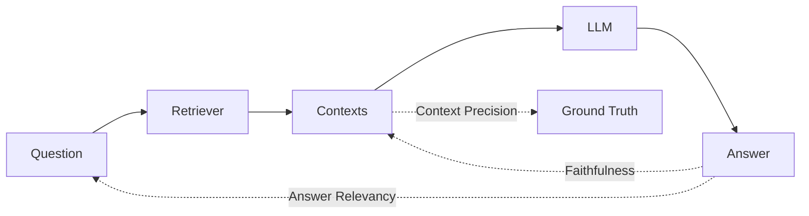

# Eval Framework: RAGAS Evaluation Pipeline

## What Was Built

### Files Created
- [test_set.json](file:///home/shrutikcs/Documents/projects/rag-pipeline/backend/eval/test_set.json) — 5 sample XAUUSD Q&A pairs
- [evaluate.py](file:///home/shrutikcs/Documents/projects/rag-pipeline/backend/eval/evaluate.py) — RAGAS scoring script

### Files Modified
- [pipeline.py](file:///home/shrutikcs/Documents/projects/rag-pipeline/backend/app/rag/pipeline.py) — `query_pipeline()` now returns `{"answer": ..., "contexts": [...]}` instead of a plain string
- [routes.py](file:///home/shrutikcs/Documents/projects/rag-pipeline/backend/app/api/routes.py) — `/query` endpoint now surfaces both `answer` and `contexts`

### Dependencies Added
```
ragas, datasets, requests
```

---

## What Each RAGAS Metric Measures

### 1. **Faithfulness** — *"Is the answer grounded in the retrieved context?"*

| Aspect | Detail |
|--------|--------|
| **Measures** | Whether every claim in the LLM's answer can be traced back to the retrieved context passages |
| **Score Range** | 0.0 → 1.0 (higher = better) |
| **How it works** | RAGAS uses an LLM to decompose the answer into individual statements, then checks each statement against the context. The score = (statements supported by context) / (total statements) |
| **Low score means** | The LLM is **hallucinating** — making claims not present in the retrieved passages |
| **Example** | If the answer says "Gold hit $2,100 in March" but no context mentions that, faithfulness drops |

> [!IMPORTANT]
> Faithfulness is your **hallucination detector**. A RAG system with low faithfulness is actively dangerous — it's confidently stating things the source data doesn't support.

---

### 2. **Answer Relevancy** — *"Does the answer actually address the question?"*

| Aspect | Detail |
|--------|--------|
| **Measures** | How relevant and focused the generated answer is to the original question |
| **Score Range** | 0.0 → 1.0 (higher = better) |
| **How it works** | RAGAS generates hypothetical questions from the answer, then measures cosine similarity between those questions and the original question. If the answer addresses the right topic, the generated questions will be semantically similar to the original |
| **Low score means** | The answer is **off-topic**, vague, or contains excessive irrelevant information |
| **Example** | Q: "What drives XAUUSD?" → A talks about silver mining → low relevancy |

> [!NOTE]
> This metric penalizes both incomplete answers (missing the point) and answers with too much irrelevant filler — it checks if the answer is *focused* on what was asked.

---

### 3. **Context Precision** — *"Are the relevant contexts ranked higher than irrelevant ones?"*

| Aspect | Detail |
|--------|--------|
| **Measures** | Whether the most relevant context passages appear at the **top** of the retrieved list (signal-to-noise ranking quality) |
| **Score Range** | 0.0 → 1.0 (higher = better) |
| **How it works** | Uses the `ground_truth` answer to judge which retrieved passages are actually relevant, then checks if those relevant passages appear early in the list (like a precision@k curve). It's a weighted precision that gives more credit to relevant contexts ranked higher |
| **Low score means** | Your **retriever is noisy** — it's pulling in irrelevant chunks, or burying the good ones below irrelevant ones |
| **Example** | If 3 contexts are retrieved but the only useful one is ranked last, precision drops |

> [!TIP]
> Context Precision directly evaluates your hybrid retriever + reranker pipeline. If this score is low, the fix is in `retriever.py` (tuning `DENSE_TOP_K`, `SPARSE_TOP_K`, `RERANK_TOP_N`) — not in the LLM prompt.

---

## How the Metrics Work Together



| Scenario | Faithfulness | Answer Relevancy | Context Precision |
|----------|:---:|:---:|:---:|
| Everything works perfectly | ✅ High | ✅ High | ✅ High |
| Retriever pulls wrong docs, LLM hallucinates | ❌ Low | ❌ Low | ❌ Low |
| Retriever is good, but LLM ignores context | ❌ Low | ⚠️ Varies | ✅ High |
| Retriever is noisy, LLM answers from noise | ✅ High | ❌ Low | ❌ Low |
| Good retrieval, good answer, but off-topic to question | ✅ High | ❌ Low | ✅ High |

---

## How to Run

```bash
# 1. Start the server (if not already running)
cd backend
uv run fastapi dev app/main.py

# 2. In another terminal, run the evaluation
cd backend
uv run python eval/evaluate.py
```

> [!WARNING]
> RAGAS uses an LLM internally for scoring (OpenAI by default). Make sure `OPENAI_API_KEY` is set in your environment or `.env` file. If you want to use a different LLM for evaluation, configure it via RAGAS settings.

## Output

The script prints:
1. **Per-question table** — scores for each test question across all 3 metrics
2. **Aggregate scores** — mean of each metric across all questions
